# Blog w Django
### I. Dokumentacja- https://tutorial.djangogirls.org/pl/

### II. Zostało utworzone konto na Python Anywhere- **dzuls**.

### III. Screeny z działania przy projekcie
- Zrzut ekranu z procesem aktywacji wirtualnego środowiska.
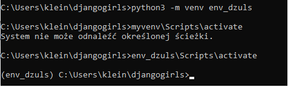

- Tą komenda używamy pliku, który został stworzony w naszym folderze aby zainstalować Django. 
`` pip install -r requirements.txt ``
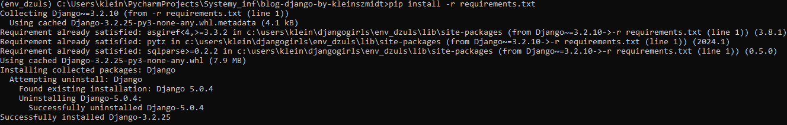


- Poniżej komenda, która utworzyła za mnie katalogii i pliki w folderze na widocznym screenie.
`django-admin.exe startproject mysite .`
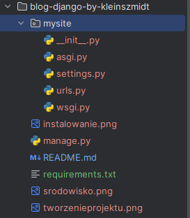


- Aby utworzyć bazę danych dla naszego bloga, wykonałam następujące polecenie w konsoli
`python manage.py migrate`
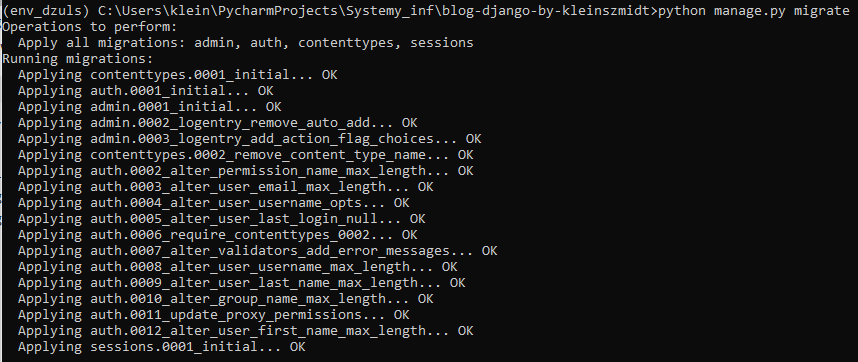

- Uruchomienie strony WWW w konsoli za pomocą:
`python manage.py runserver`
Następnie wpisanie adresu w przeglądarkę: http://127.0.0.1:8000/ 
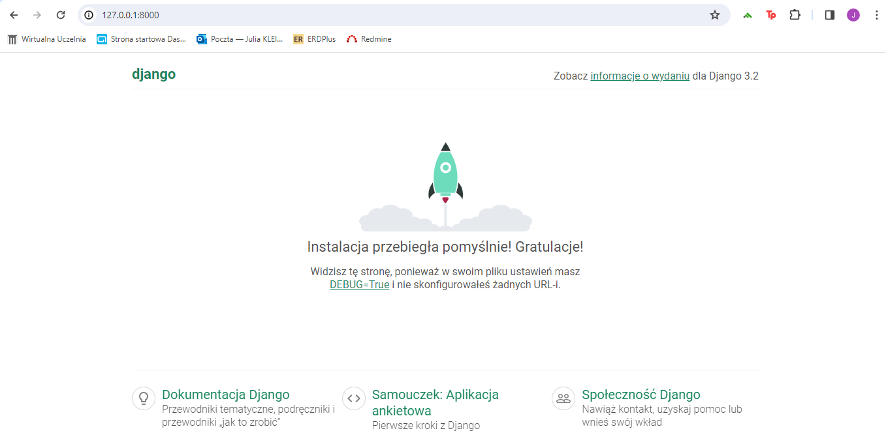


- Tworzenie osobnej aplikacji wewnątrz naszego projektu, aby utrzymać porządek
`python manage.py startapp blog` 
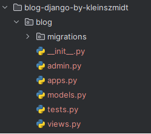


- Dodanie naszego nowego modelu do bazy danych
`python manage.py makemigrations blog`


- Django przygotował dla nas plik z migracjami, które musimy zastosować teraz do naszej bazy danych. 
Wpisałam: `python manage.py migrate blog` a wynik wygląda tak:
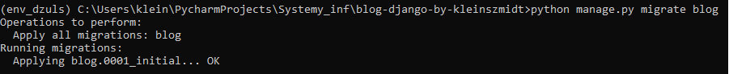


- W celu dodawania, edycji czy usuwania artykułów, dla których model przed chwilą stworzyłyśmy, użyjemy admina Django.
Po zmianie kodu tak jak jest to opisane w tutorialu oraz wpisaniu
`python manage.py runserver` przeszłam do przeglądarki http://127.0.0.1:8000/admin/ - wyświetli się formularz do zalogowania.


- Wpisuje w do wiersza `python manage.py createsuperuser`, następnie ustawiam nazwe użytkownika, maila itp. oraz loguje się do adminia
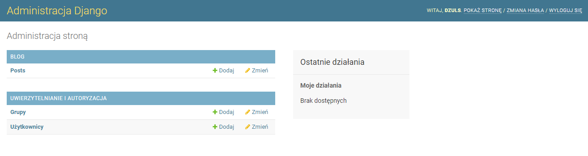

- Tworzenie repozytorium Git `git init` oraz `git config --global user.name "Twoja Nazwa Uzytkownika"` i `git config --global user.email ty@adres.pl`

- Utworzenie pliku .gitignore i dodanie treści
`*.pyc
*~
__pycache__
env_dzuls
db.sqlite3
/static
.DS_Store`


- Sprawdzenie zawartości, informację o wszystkich nieśledzonych/zmienionych/zaplanowanych do najbliższego commita plików, statusie brancha 
za pomocą `git status` : 
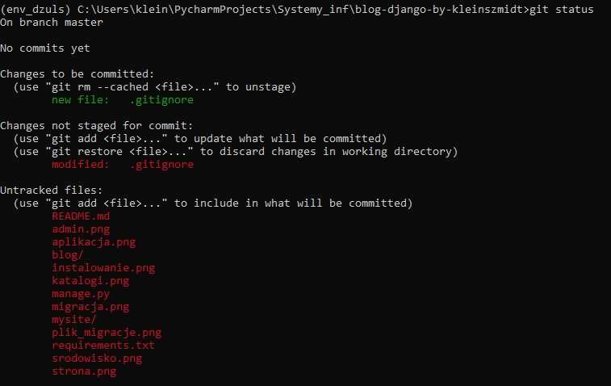

- Zapisanie zmian za pomocą `git add --all` oraz `git commit -m "My Django Girls app, first commit"`
- Mój kod znajduję się już na GitHubie.
- ### Wdrożenie aplikacji internetowej w PythonAnywhere
`pip3.6 install --user pythonanywhere` w konsoli Bash, następnie 
`pa_autoconfigure_django.py https://github.com/kleinszmidt/Integracja_systemow.git`

- Zainicjowanie konta administratora- PythonAnywhere 
`(dzuls.pythonanywhere.com) $ python manage.py createsuperuser`
Sprawdzam swój kod za pomocą `ls` i wygląda następująco:
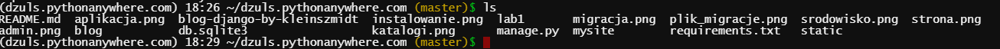

- Moja strona jest dostępna pod adresem: https://dzuls.pythonanywhere.com/


- Zaimportowanie URL-e z naszej aplikacji blog do głównego pliku mysite/urls.py.
- Stworzenie nowego pustego pliku urlsy.py o treści: 
```from django.urls import path
from . import views

urlpatterns = [
    path('', views.post_list, name='post_list'),
]
```

- Utworzenie view zgodnie z sugestiami komentarzy
`def post_list(request):
    return render(request, 'blog/post_list.html', {})`
Po zapisaniu pliku i przejściu na adres:  http://127.0.0.1:8000/ wygląda tak: 

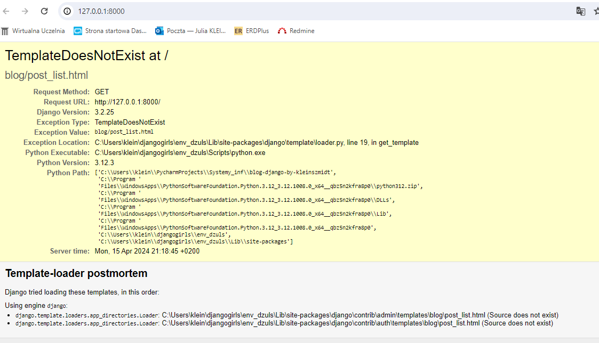


